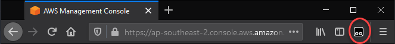
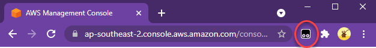
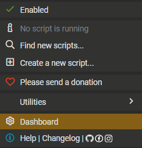
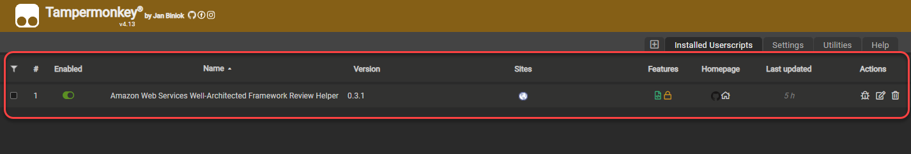
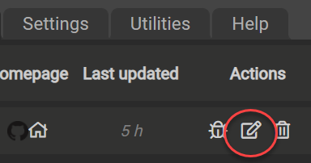
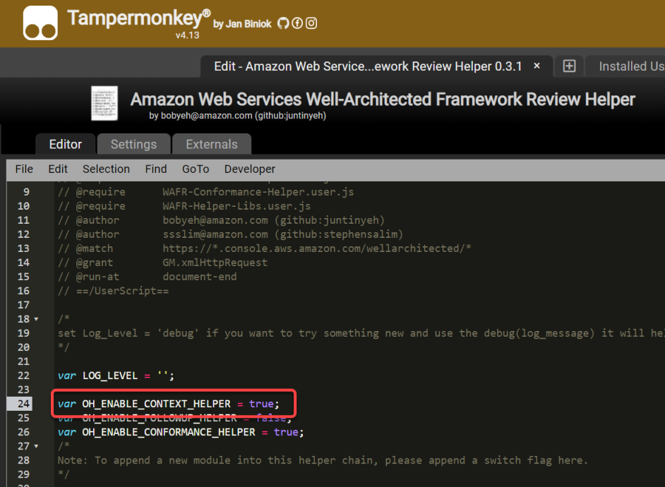

# AWS Well Architected Review Context helper

## Help Links

| Help | Link | 
| ------------- | ------------- | 
| 1. How to confirm you have the script ready | [Click](#-How-to-confirm-script-is-ready) | 
| 2. How to use | [Click](#-How-to-use) | 
| 3. How to customize metadata | [Click](#How-to-customize-metadata) |
| 4. How to create new language metadata | [Click](#How-to-create-new-language-metadata) |

## How to confirm script is ready

1. Ensure you have installed the AWS Well Architected Review helper user script. If you have not, follow the **Getting Started** question of the main README file [here](README.md)

2. Once you have done the above step, locate the **Tempermonkey** icon from the extension or add-on list of your browser. This is  located on the right hand side of your browser address bar.

    **Firefox:** 
        
    
    **Chrome:**
        

3. Click on the icon, and select **Dashboard**

     

4. Ensure you have the **Amazon Web Services Well-Architected Framework Review Helper** script installed and enabled.

     

5. Select the script and click on **Edit** icon under action.

     

6. Ensure that you have **OH_ENABLE_CONTEXT_HELPER** variable set to **true**

     

## How to customize metadata

## How to create new language metadata
