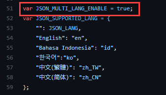
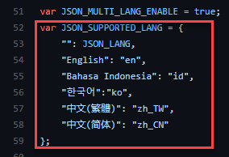

# AWS Well Architected Review Context helper

## Help Links

| Help | Link | 
| ------------- | ------------- | 
| 1. How to confirm you have the script ready | [Click](#-How-to-confirm-script-is-ready) | 
| 2. How to customize metadata | [Click](#How-to-customize-metadata) |
| 3. How to create new language metadata | [Click](#How-to-create-new-language-metadata) |
| 4. Context Metadata | [Click](#Context-metadata-structure) |
## How to confirm script is ready

1. Ensure you have installed the AWS Well Architected Review helper user script. If you have not, follow the **Getting Started** question of the main README file [here](README.md)

2. Once you have done the above step, locate the **Tempermonkey** icon from the extension or add-on list of your browser. This is  located on the right hand side of your browser address bar.

    **Firefox:** 

     
    
    **Chrome:**
     
     

3. Click on the icon, and select **Dashboard**

     

4. Ensure you have the **Amazon Web Services Well-Architected Framework Review Helper** script installed and enabled.

     

5. Select the script and click on **Edit** icon under action.

     

6. Ensure that you have **OH_ENABLE_CONTEXT_HELPER** variable set to **true**

     

## How to customize metadata


1. Create a new github repository, follow github documentation [page](https://docs.github.com/en/github/creating-cloning-and-archiving-repositories/creating-a-repository-on-github/creating-a-new-repository) 

2. On the GitHub website, click on you repository you created.

3. Locate the green button named Code and click on it. 

4. The GitHub URL will appear.

5. Copy this  GitHub URL.

     

6. Run below command to clone the github repo to you local machine. 

     ```
     git clone <the url you copied in previous step>
     ```

7. Change directory to the folder that has been created by the above command.

8. Run below command 

     ```
     git remote add wafr-helper-repo https://github.com/stephensalim/aws-wafr-objective-helper.git
     git pull wafr-helper-repo main
     ```

9. Once you see the files populated, open file `WAFR-Review-Helper.user.js`,then change the url in @include section ( line 6 .) 
Replace the value from `https://raw.githubusercontent.com/juntinyeh/aws-wafr-objective-helper/main/` to `https://raw.githubusercontent.com/<Your github username>/<Your github repo name>/main/`. 
     
10. Save the file change once you are done.

11. Open file `WAFR-Context-Helper.user.js`. Locate variable called **JSON_BASE_DIR** ( line 36).
Replace the value from `https://raw.githubusercontent.com/juntinyeh/aws-wafr-objective-helper/main/objective-helper/` to `https://raw.githubusercontent.com/<Your github username>/<Your github repo name>/main/objective-helper/` 
     
12. Save the file change once you are done.

13. Open the corresponding `objective-helper.*.json` under the `objective-helper/` folder, update the metadata accordingly. Refer to [Context metadata structure](#Context-metadata-structure) for details on supported syntax and structures.

14. Save the file under `objective-helper.<language code>.json` name, replacing the <language code> with [ISO 639-1 Code](https://en.wikipedia.org/wiki/List_of_ISO_639-1_codes) for the language. 

15. Run bellow commands to commit the change

     ```
     git add WAFR-Review-Helper.user.js
     git add WAFR-Context-Helper.user.js
     git commit -m "Modified Repo"
     git push origin main
     ```
16. Once you have completed the task copy and paste below url in your browser, replacing the value in <> with your own.
    `https://github.com/<Your github username>/<Your github repo name>/raw/main/WAFR-Review-Helper.user.js`

17. This will prompt you to install the **Tempermonkey** script if you have it installed.

     

18. You should then see another prompt from **Tempermonkey** asking you to allow access to the url. Click on **Always Allow Domain**.

    


## How to create new language metadata

1. Follow the steps to customize your own metadata [here](#How-to-customize-metadata)

2. Once completed, open `WAFR-Context-Helper.user.js` and ensure that **JSON_MULTI_LANG_ENABLE** variable ( line 51 ) is set to `true`

     

3. Append **JSON_SUPPORTED_LANG** json variable with the new language you created. Use the language name as the key, and the corresponding [ISO 639-1 Code](https://en.wikipedia.org/wiki/List_of_ISO_639-1_codes) as it's value.

     


## Context metadata structure

TBA