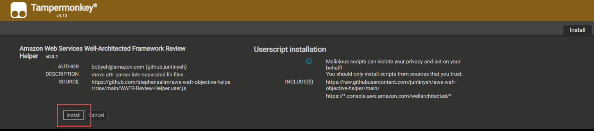
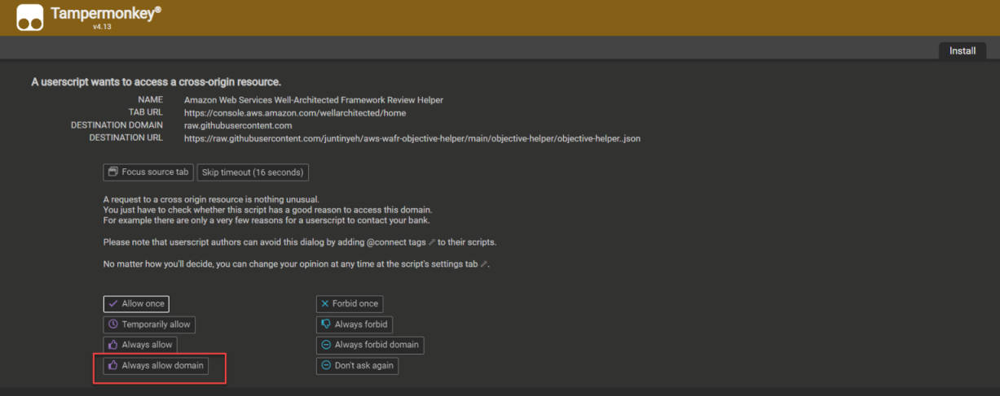
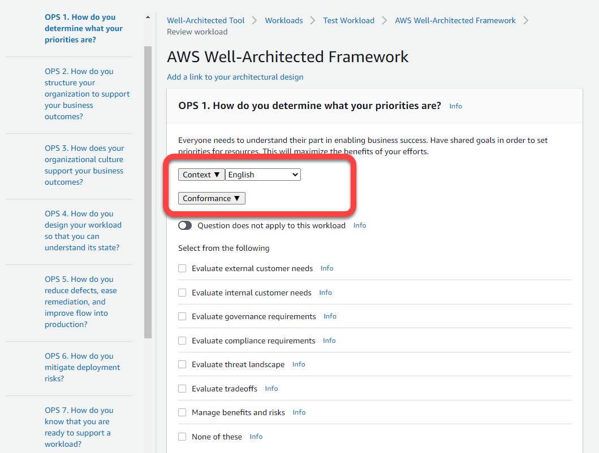

# AWS Well Architected Review helper.

The AWS Well Architected Review helper is a compilation of open-source browser user scripts and aws services solution to assist conducting effective well architected review. 

Currently AWS Well Architected Review helper has below capabilities:

| CAPABILITY | Description | User Guide |
| ------------- | ------------- | ------------- |
| Context  | Show additional context into Well Architected Questions. (Objectives, Domain, Question connections, Local Language )  | [Click](CONTEXT-HOW-TO.md) | 
| Conformance | Display AWS Config Conformance check results related to the question   | [Click](CONFORMANCE-HOW-TO.md) |

---
## License & Usage guide

---

## Getting Started

To get started with AWS Well Architected Review helper you will need to install the **Tempermonkey** browser extension / add-on:

1. Click on one of the link below to download **Tempermonkey** and install in your browser.
    - [Firefox](https://addons.mozilla.org/en-US/firefox/addon/tampermonkey/).
    - [Chrome](https://chrome.google.com/webstore/detail/tampermonkey/dhdgffkkebhmkfjojejmpbldmpobfkfo).

2. Click [here](https://github.com/stephensalim/aws-wafr-objective-helper/raw/main/WAFR-Review-Helper.user.js) to install the user script into your browser. 

3. Your browser will prompt below message, click on the install button as per the screen shot to install the script.
    
    

4. Go to the **AWS Well Architected Tool** console [here](https://console.aws.amazon.com/wellarchitected/)

5. You should then see another prompt from **Tempermonkey** asking you to allow access to the url. Click on **Always Allow Domain**.

    

6. Define a new Well Architected Review workload by following this guide [here](https://docs.aws.amazon.com/wellarchitected/latest/userguide/tutorial-step1.html).

7. Click on **Start reviewing**, select **AWS Well-Architected Framework** lens.

8. Once you arrive in the question page, you should see the additional capability added into the tool.

    

9. Review the **User guide** guide for each capability:

    - [Context](CONTEXT-HOW-TO.md). - Guide to use and extend **Context** capability.
    - [Conformance](CONFORMANCE-HOW-TO.md). - Guide to use and extend **Conformance** capability.
    - [Modification](DEV-HOW-TO.md). - Guide to extend and modify **AWS Well Architected Review Helper** user script.
---

## What is this Github repository? 💻

TBA

## How do i contribute ? 

TBA

## Join the Community on Slack

TBA

